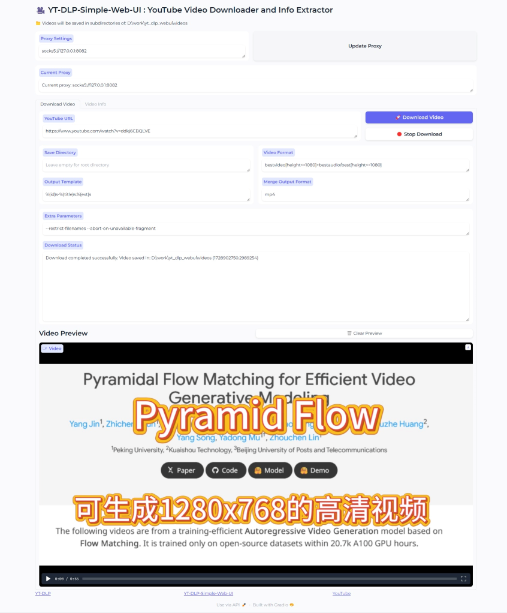
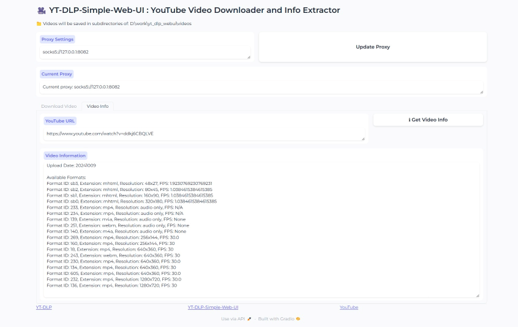

# YT-DLP-Simple-Web-UI

> **Note**: This project, including the code and this README, was generated with Claude, an AI language model by Anthropic. While the content has been tailored to this specific project, it showcases the potential of AI in software development and documentation.

YT-DLP-Simple-Web-UI is a user-friendly web interface for the popular YouTube downloader [yt-dlp](https://github.com/yt-dlp/yt-dlp). This project provides an easy-to-use Gradio-based GUI for downloading YouTube videos and extracting video information.

[中文](README.zh.md)

## Features

- 🎥 Download YouTube videos with customizable format options
- ℹ️ Extract detailed information about YouTube videos
- 🌐 Support for proxy settings
- 🎛️ Advanced options for power users
- 🖼️ Video preview functionality
- 🛑 Ability to stop ongoing downloads

## Screenshots

### Main Interface

*Description: The main interface of YT-DLP-Simple-Web-UI showing the URL input, download options, and status display.*

### Video Information

*Description: The video information tab displaying detailed metadata about a YouTube video.*

## Installation

1. Clone this repository:
   ```
   git clone https://github.com/yourusername/YT-DLP-Simple-Web-UI.git
   cd YT-DLP-Simple-Web-UI
   ```

2. Install the required dependencies:
   ```
   pip install -r requirements.txt
   ```

## Usage

1. Run the application:
   ```
   python yt_dlp_webui.py
   ```

2. Open your web browser and navigate to the URL displayed in the console (typically `http://127.0.0.1:7860`).

3. Enter a YouTube URL and customize your download settings as needed.

4. Click "Download Video" to start the download process.

## Configuration

- **Proxy Settings**: Enter your proxy URL in the "Proxy Settings" field and click "Update Proxy".
- **Video Format**: Customize the video format string (default: `bestvideo[height<=1080]+bestaudio/best[height<=1080]`)
- **Output Template**: Modify the output filename template (default: `%(id)s-%(title)s.%(ext)s`)
- **Extra Parameters**: Add any additional yt-dlp command-line parameters as needed

## Advanced Usage

### Custom Output Directory
You can specify a custom output directory for your downloads. Simply enter the desired subdirectory name in the "Save Directory" field. The videos will be saved in a subdirectory of the base video directory.

### Format Selection
For advanced users, you can fine-tune your video format selection using yt-dlp format strings. For example:
- `bestvideo[height<=720]+bestaudio/best[height<=720]`: Best quality video up to 720p
- `worstvideo+worstaudio/worst`: Lowest quality available (useful for testing)

### Troubleshooting Downloads
If you encounter issues with a download, try the following:
1. Update the proxy settings if you're behind a firewall
2. Use the "Get Video Info" feature to check available formats
3. Try adding `--force-ipv4` to the Extra Parameters if you're having network issues

## Contributing

Contributions are welcome! Here's how you can contribute to YT-DLP-Simple-Web-UI:

1. Fork the repository
2. Create a new branch (`git checkout -b feature/AmazingFeature`)
3. Commit your changes (`git commit -m 'Add some AmazingFeature'`)
4. Push to the branch (`git push origin feature/AmazingFeature`)
5. Open a Pull Request

Please ensure your code adheres to the project's coding standards and includes appropriate tests.

## License

This project is licensed under the MIT License - see the [LICENSE](LICENSE) file for details.

## Acknowledgments

- [yt-dlp](https://github.com/yt-dlp/yt-dlp) for the core downloading functionality
- [Gradio](https://www.gradio.app/) for the web UI framework
- Claude AI by Anthropic for assistance in generating this project

## Disclaimer

This project is for educational purposes only. Please respect YouTube's terms of service and copyright laws when using this tool.

## Future Enhancements

- [ ] Batch download functionality
- [ ] Save/Load configuration options

Your feedback and suggestions for improvements are always welcome!
